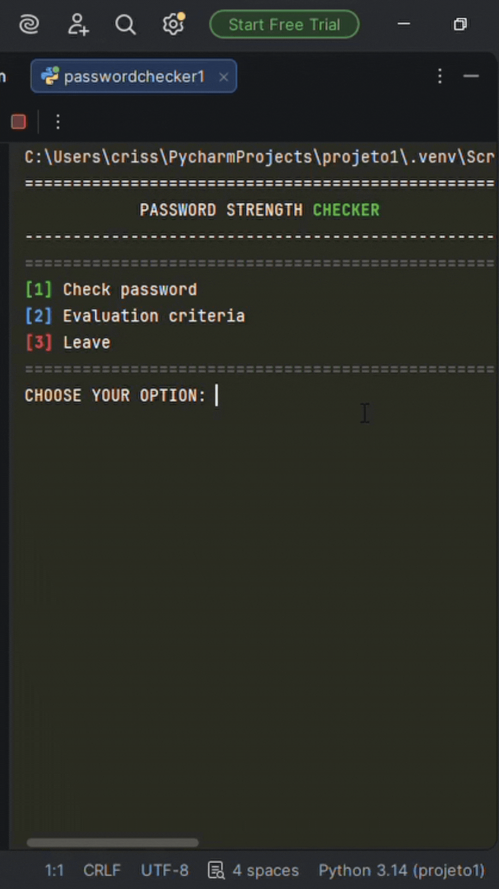
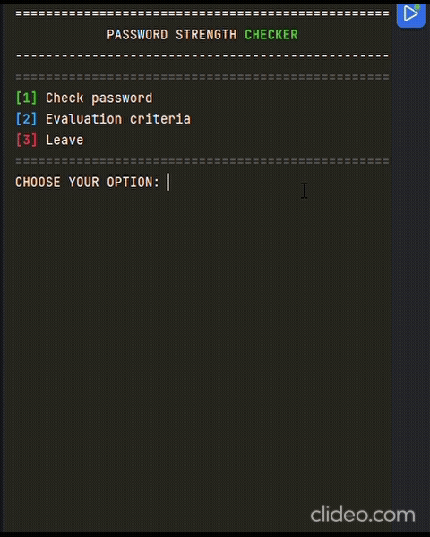

# 🗝️ྀི PASSWORD CHECKER
A simple Python terminal tool that checks how strong your password is.

## •🧩• ABOUT
>> This project was built as a Python exercise. The goal was to create a pratical CLI tool that evaluates password security based on common rules, while practicing functions, loops and string handling.

## -⚙️- FUNCTIONALITIES
> ***¬>*** Check the strenght of any password instantly. <br>
> ***¬>*** Scores passwords across 4 security critera. <br>
> ***¬>*** Returns a rating: 'WEAK','GOOD' or 'STRONG'. <br>
> ***¬>*** Color-coded terminal output using ANSI codes. <br>
> ***¬>*** Simple interactive menu to navigate de tool.

## ¬💻¬ TECHNOLOGIES
>>**LANGUAGE**: Python 3 <br>
>>**LIBRARIES**: String (built-in, no installs needed)

## > 📲 < IMAGES
### *[1]* CHECK PASSWORD  
  
### *[2 -> 3]* EVALUATION CRITERIA AND LEAVE  


## ¨✨¨ HOW TO RUN

``` bash
git clone https://github.com/SavelliCris/password-checker.git
cd password-checker
python main.py
```

